# System Architecture Analysis

## Overview

- **Project**: /home/tom/github/pactown-com/propact
- **Primary Language**: python
- **Languages**: python: 24, shell: 21
- **Analysis Mode**: static
- **Total Functions**: 250
- **Total Classes**: 61
- **Modules**: 45
- **Entry Points**: 239

## Architecture by Module

### src.propact.config
- **Functions**: 19
- **Classes**: 12
- **File**: `config.py`

### src.propact.adapters
- **Functions**: 17
- **Classes**: 6
- **File**: `adapters.py`

### src.propact.uniconverter
- **Functions**: 17
- **Classes**: 3
- **File**: `uniconverter.py`

### src.propact.enhanced
- **Functions**: 16
- **Classes**: 2
- **File**: `enhanced.py`

### src.propact.error_handler
- **Functions**: 15
- **Classes**: 3
- **File**: `error_handler.py`

### src.propact.converter
- **Functions**: 15
- **Classes**: 3
- **File**: `converter.py`

### src.propact.matcher
- **Functions**: 14
- **Classes**: 2
- **File**: `matcher.py`

### src.propact.optimization
- **Functions**: 13
- **Classes**: 3
- **File**: `optimization.py`

### src.propact.cli
- **Functions**: 11
- **File**: `cli.py`

### examples.run-all
- **Functions**: 11
- **File**: `run-all.sh`

### src.propact.validation
- **Functions**: 11
- **Classes**: 4
- **File**: `validation.py`

### src.propact.security
- **Functions**: 10
- **Classes**: 2
- **File**: `security.py`

### src.propact.llm_proxy
- **Functions**: 10
- **Classes**: 2
- **File**: `llm_proxy.py`

### src.propact.core
- **Functions**: 8
- **Classes**: 1
- **File**: `core.py`

### src.propact.query_gen
- **Functions**: 8
- **Classes**: 1
- **File**: `query_gen.py`

### src.propact.attachments
- **Functions**: 7
- **Classes**: 1
- **File**: `attachments.py`

### src.propact.protocols.mcp
- **Functions**: 7
- **Classes**: 2
- **File**: `mcp.py`

### src.propact.protocols.ws
- **Functions**: 7
- **Classes**: 3
- **File**: `ws.py`

### examples.05-security-hardening.secure_handler
- **Functions**: 7
- **Classes**: 2
- **File**: `secure_handler.py`

### src.propact.protocols.rest
- **Functions**: 6
- **Classes**: 4
- **File**: `rest.py`

## Key Entry Points

Main execution flows into the system:

### src.propact.cli.main
> Execute Protocol Pact documents.

FILE_PATH: Path to the markdown file containing protocol blocks.
- **Calls**: cli.command, click.argument, click.option, click.option, click.option, click.option, click.option, click.option

### src.propact.config.ConfigManager._load_config
> Load configuration from environment variables.
- **Calls**: OpenAIConfig, GRPCConfig, MQTTConfig, SMTPConfig, WebSocketConfig, ServerConfig, MCPConfig, LoggingConfig

### src.propact.uniconverter.UniConverter._md_to_docx
> Convert Markdown to DOCX.
- **Calls**: Document, markdown_content.split, doc.save, ConversionResult, ConversionResult, line.startswith, doc.add_table, enumerate

### src.propact.cli.universal
> Universal document converter (PDF, DOCX, PPTX, XLSX, HTML, Email ↔ MD).
- **Calls**: cli.command, click.argument, click.option, click.option, click.option, click.option, click.option, click.option

### src.propact.enhanced.Propact.send_to_endpoint
> Send split markdown content to endpoint and convert response to markdown.

Args:
    endpoint: Target endpoint URL/command
    
Returns:
    Response 
- **Calls**: self._smart_split_md, MDConverter.prepare_payload, endpoint.startswith, self.file_path.with_suffix, output_path.write_text, endpoint.startswith, None.get, MDConverter.response_to_markdown

### examples.05-security-hardening.secure_handler.demo_security
> Demonstrate security features with attack samples.
- **Calls**: print, SecureMarkdownHandler, attack_file.read_text, print, print, print, print, print

### src.propact.core.ToonPact.smart_send
> Send markdown content to the best-matched endpoint using semantic matching.

Args:
    base_url: Base URL for the API
    openapi_spec: OpenAPI specif
- **Calls**: Console, self.file_path.read_text, PropactErrorHandler, src.propact.matcher.create_matcher, console.print, enumerate, console.print, ProtocolBlock

### src.propact.cli.file
> Convert a file from one format to another.
- **Calls**: convert.command, click.argument, click.option, click.option, click.option, click.option, click.option, click.option

### src.propact.adapters.EmailAdapter.send
> Send email.
- **Calls**: self.endpoint.startswith, MIMEMultipart, None.get, payload.get, None.items, smtplib.SMTP, server.starttls, msg.as_string

### src.propact.uniconverter.UniConverter._email_to_md
> Convert email file to Markdown.
- **Calls**: content_parts.append, content_parts.append, content_parts.append, content_parts.append, content_parts.append, content_parts.append, msg.is_multipart, ConversionResult

### src.propact.cli.send_email
> Send Markdown as rich HTML email.
- **Calls**: cli.command, click.argument, click.option, click.option, click.option, click.option, click.option, click.option

### src.propact.uniconverter.UniConverter.send_email
> Send Markdown content as rich HTML email.

Args:
    markdown_content: Markdown content to send
    to_emails: Recipient email(s)
    subject: Email s
- **Calls**: MIMEMultipart, isinstance, None.join, MIMEText, msg.attach, ConversionResult, self.md.convert, MIMEText

### src.propact.cli.string
> Convert a string from one format to another.
- **Calls**: convert.command, click.argument, click.option, click.option, click.option, click.option, click.option, click.option

### src.propact.cli.batch
> Batch convert files in a directory.
- **Calls**: cli.command, click.argument, click.option, click.option, click.option, UniConverter, list, console.print

### src.propact.security.MDSanitizer.audit
> Audit markdown content for security issues.

Args:
    markdown: Markdown content to audit
    
Returns:
    Dictionary with audit results
- **Calls**: self._protocol_pattern.findall, self._script_pattern.search, self._base64_pattern.findall, issues.append, self._html_tag_pattern.findall, len, len, bool

### examples.05-security-hardening.secure_handler.SecureMarkdownHandler.process
> Process markdown content with security checks.

Args:
    markdown_content: Raw markdown content
    source: Source identifier for logging
    
Return
- **Calls**: None.isoformat, self.sanitizer.audit, self.sanitizer.sanitize, self.optimizer.optimize, MarkdownParser, self.logger.info, None.extend, self.pipeline.validate

### src.propact.validation.ValidationPipeline.validate
> Validate markdown content.

Args:
    markdown: Markdown content to validate
    schema_name: Name of schema to validate against
    schema_version: V
- **Calls**: None.hexdigest, ValidationResult, hashlib.sha256, self.sanitizer.audit, self.sanitizer.sanitize, self.parser.parse, result.warnings.append, self.schema_registry.get_schema

### src.propact.enhanced.Propact._response_to_md
> Convert response to markdown format.
- **Calls**: None.join, md_lines.append, md_lines.append, md_lines.append, md_lines.append, md_lines.append, md_lines.append, md_lines.append

### src.propact.converter.MDConverter.extract_from_markdown
> Extract all content from markdown.

Args:
    md_content: Markdown content to parse
    
Returns:
    ExtractedContent with media, codeblocks, and tex
- **Calls**: ExtractedContent, MDConverter.MEDIA_PATTERN.finditer, MDConverter.CODEBLOCK_PATTERN.findall, MDConverter.CODEBLOCK_PATTERN.sub, MDConverter.MEDIA_PATTERN.sub, plain_text.strip, match.groups, content.strip

### src.propact.adapters.MQTTAdapter.send
> Send MQTT message.
- **Calls**: None.split, src.propact.config.get_mqtt_config, mqtt.Client, client.connect, json.dumps, client.publish, result.wait_for_publish, client.disconnect

### src.propact.uniconverter.UniConverter._md_to_xlsx
> Convert Markdown tables to XLSX.
- **Calls**: openpyxl.Workbook, markdown_content.split, wb.save, ConversionResult, ConversionResult, str, all, enumerate

### src.propact.enhanced.Propact._send_rest
> Send content via REST API.
- **Calls**: None.items, None.items, httpx.AsyncClient, isinstance, None.items, client.post, dict, json.dumps

### src.propact.uniconverter.UniConverter.from_markdown
> Convert Markdown to any supported format.

Args:
    markdown_content: Markdown content to convert
    output_path: Path for output file
    output_fo
- **Calls**: Path, None.lstrip, ConversionResult, self._md_to_pdf, self.logger.error, ConversionResult, output_path.suffix.lower, self._md_to_html

### src.propact.enhanced.Propact._introspect_schema
> Introspect schema from file (OpenAPI, CLI, etc.).
- **Calls**: Path, schema_path.endswith, schema_file.exists, schema_path.endswith, schema_path.endswith, prance.ResolvingParser, schema_path.endswith, schema_path.endswith

### src.propact.error_handler.PropactErrorHandler._fallback_search
> Search for similar endpoints using keywords and Levenshtein.
- **Calls**: self._extract_keywords, None.items, None.items, error.error_msg.lower, methods.items, method.upper, path.lower, None.lower

### src.propact.optimization.MDOptimizer._optimize_code_blocks
> Optimize large code blocks by chunking them.
- **Calls**: match.groups, range, enumerate, self.large_text_pattern.sub, len, match.group, len, chunk_file.parent.mkdir

### src.propact.uniconverter.UniConverter.to_markdown
> Convert any supported format to Markdown.

Args:
    input_path: Path to input file
    input_format: Format of input file (auto-detected if None)
   
- **Calls**: Path, input_path.exists, ConversionResult, None.lstrip, ConversionResult, self._markitdown_to_md, self.logger.error, ConversionResult

### src.propact.uniconverter.UniConverter._md_to_pptx
> Convert Markdown to PPTX.
- **Calls**: Presentation, re.split, prs.save, ConversionResult, ConversionResult, None.split, prs.slides.add_slide, str

### src.propact.optimization.MDOptimizer._optimize_image
> Optimize image data.
- **Calls**: Image.open, io.BytesIO, format_map.get, output.getvalue, io.BytesIO, Image.new, background.paste, img.thumbnail

### src.propact.validation.ValidationPipeline.detect_schema_drift
> Detect schema drift in markdown content.

Args:
    markdown: Markdown content with schema pins
    
Returns:
    Dictionary of schema drift status
- **Calls**: markdown.startswith, markdown.find, frontmatter.split, self.logger.error, line.split, key.strip, value.strip, key.strip

## Process Flows

Key execution flows identified:

### Flow 1: main
```
main [src.propact.cli]
```

### Flow 2: _load_config
```
_load_config [src.propact.config.ConfigManager]
```

### Flow 3: _md_to_docx
```
_md_to_docx [src.propact.uniconverter.UniConverter]
```

### Flow 4: universal
```
universal [src.propact.cli]
```

### Flow 5: send_to_endpoint
```
send_to_endpoint [src.propact.enhanced.Propact]
```

### Flow 6: demo_security
```
demo_security [examples.05-security-hardening.secure_handler]
```

### Flow 7: smart_send
```
smart_send [src.propact.core.ToonPact]
  └─ →> create_matcher
```

### Flow 8: file
```
file [src.propact.cli]
```

### Flow 9: send
```
send [src.propact.adapters.EmailAdapter]
```

### Flow 10: _email_to_md
```
_email_to_md [src.propact.uniconverter.UniConverter]
```

## Key Classes

### src.propact.uniconverter.UniConverter
> Universal document converter supporting 15+ formats.
- **Methods**: 16
- **Key Methods**: src.propact.uniconverter.UniConverter.__init__, src.propact.uniconverter.UniConverter.to_markdown, src.propact.uniconverter.UniConverter.from_markdown, src.propact.uniconverter.UniConverter.send_email, src.propact.uniconverter.UniConverter._markitdown_to_md, src.propact.uniconverter.UniConverter._html_to_md, src.propact.uniconverter.UniConverter._email_to_md, src.propact.uniconverter.UniConverter._pandoc_to_md, src.propact.uniconverter.UniConverter._md_to_pdf, src.propact.uniconverter.UniConverter._md_to_html

### src.propact.enhanced.Propact
> Enhanced Propact class with schema introspection and intelligent content splitting.

Capable of pars
- **Methods**: 15
- **Key Methods**: src.propact.enhanced.Propact.__init__, src.propact.enhanced.Propact._introspect_schema, src.propact.enhanced.Propact._smart_split_md, src.propact.enhanced.Propact._detect_schema_type, src.propact.enhanced.Propact._adapt_to_openapi, src.propact.enhanced.Propact._adapt_to_shell, src.propact.enhanced.Propact._adapt_to_mcp, src.propact.enhanced.Propact._get_mime_type, src.propact.enhanced.Propact.send_to_endpoint, src.propact.enhanced.Propact._send_rest
- **Inherits**: ToonPact

### src.propact.error_handler.PropactErrorHandler
> Multi-layer error recovery system for Propact.
- **Methods**: 15
- **Key Methods**: src.propact.error_handler.PropactErrorHandler.__init__, src.propact.error_handler.PropactErrorHandler.handle_match_failure, src.propact.error_handler.PropactErrorHandler._llm_self_correct, src.propact.error_handler.PropactErrorHandler._llm_self_correct_litellm, src.propact.error_handler.PropactErrorHandler._llm_self_correct_ollama, src.propact.error_handler.PropactErrorHandler._fallback_search, src.propact.error_handler.PropactErrorHandler._fix_client_error, src.propact.error_handler.PropactErrorHandler._fix_client_error_litellm, src.propact.error_handler.PropactErrorHandler._fix_client_error_ollama, src.propact.error_handler.PropactErrorHandler._retry_with_backoff

### src.propact.converter.MDConverter
> Universal converter for markdown ↔ various formats.
- **Methods**: 14
- **Key Methods**: src.propact.converter.MDConverter.response_to_markdown, src.propact.converter.MDConverter._binary_to_markdown, src.propact.converter.MDConverter._dict_to_markdown, src.propact.converter.MDConverter._text_to_markdown, src.propact.converter.MDConverter.extract_from_markdown, src.propact.converter.MDConverter.prepare_payload, src.propact.converter.MDConverter._prepare_openapi_payload, src.propact.converter.MDConverter._prepare_multipart_payload, src.propact.converter.MDConverter._prepare_json_payload, src.propact.converter.MDConverter._prepare_form_payload

### src.propact.config.ConfigManager
> Manages configuration loading and access.
- **Methods**: 9
- **Key Methods**: src.propact.config.ConfigManager.__init__, src.propact.config.ConfigManager._find_env_file, src.propact.config.ConfigManager._load_env, src.propact.config.ConfigManager._get_env_bool, src.propact.config.ConfigManager._get_env_int, src.propact.config.ConfigManager._get_env_path, src.propact.config.ConfigManager.config, src.propact.config.ConfigManager._load_config, src.propact.config.ConfigManager.reload

### src.propact.security.MDSanitizer
> Markdown sanitizer for security protection.
- **Methods**: 8
- **Key Methods**: src.propact.security.MDSanitizer.__init__, src.propact.security.MDSanitizer.sanitize, src.propact.security.MDSanitizer._remove_scripts, src.propact.security.MDSanitizer._sanitize_links, src.propact.security.MDSanitizer._sanitize_base64_images, src.propact.security.MDSanitizer._sanitize_html, src.propact.security.MDSanitizer._strict_sanitization, src.propact.security.MDSanitizer.audit

### src.propact.optimization.MDOptimizer
> Markdown payload optimizer.
- **Methods**: 8
- **Key Methods**: src.propact.optimization.MDOptimizer.__init__, src.propact.optimization.MDOptimizer.optimize, src.propact.optimization.MDOptimizer._optimize_base64_images, src.propact.optimization.MDOptimizer._optimize_image, src.propact.optimization.MDOptimizer._optimize_code_blocks, src.propact.optimization.MDOptimizer._add_compression_metadata, src.propact.optimization.MDOptimizer.create_chunks, src.propact.optimization.MDOptimizer.get_optimization_report

### src.propact.core.ToonPact
> Main class for executing Protocol Pact documents.

Handles markdown documents with protocol blocks f
- **Methods**: 8
- **Key Methods**: src.propact.core.ToonPact.__init__, src.propact.core.ToonPact.smart_send, src.propact.core.ToonPact.load, src.propact.core.ToonPact.execute, src.propact.core.ToonPact._execute_shell, src.propact.core.ToonPact._execute_mcp, src.propact.core.ToonPact._execute_rest, src.propact.core.ToonPact._execute_ws

### src.propact.attachments.AttachmentHandler
> Handles binary attachments in Protocol Pact documents.
- **Methods**: 7
- **Key Methods**: src.propact.attachments.AttachmentHandler.__init__, src.propact.attachments.AttachmentHandler.load_attachment, src.propact.attachments.AttachmentHandler.save_attachment, src.propact.attachments.AttachmentHandler.encode_base64, src.propact.attachments.AttachmentHandler.decode_base64, src.propact.attachments.AttachmentHandler.get_mime_type, src.propact.attachments.AttachmentHandler.extract_from_markdown

### src.propact.llm_proxy.LiteLLMProxy
> Unified interface for 100+ LLM providers via LiteLLM.
- **Methods**: 7
- **Key Methods**: src.propact.llm_proxy.LiteLLMProxy.__init__, src.propact.llm_proxy.LiteLLMProxy._load_config, src.propact.llm_proxy.LiteLLMProxy.generate, src.propact.llm_proxy.LiteLLMProxy.astream, src.propact.llm_proxy.LiteLLMProxy.generate_sync, src.propact.llm_proxy.LiteLLMProxy.list_providers, src.propact.llm_proxy.LiteLLMProxy.from_env

### src.propact.protocols.mcp.MCPProtocol
> Handles MCP (Model Context Protocol) communication within Protocol Pact.
- **Methods**: 7
- **Key Methods**: src.propact.protocols.mcp.MCPProtocol.__init__, src.propact.protocols.mcp.MCPProtocol.register_tool, src.propact.protocols.mcp.MCPProtocol.register_resource, src.propact.protocols.mcp.MCPProtocol.execute_tool, src.propact.protocols.mcp.MCPProtocol.get_resource, src.propact.protocols.mcp.MCPProtocol.create_list_tools_response, src.propact.protocols.mcp.MCPProtocol.create_list_resources_response

### src.propact.protocols.ws.WebSocketProtocol
> Handles WebSocket communication within Protocol Pact.
- **Methods**: 7
- **Key Methods**: src.propact.protocols.ws.WebSocketProtocol.__init__, src.propact.protocols.ws.WebSocketProtocol.connect, src.propact.protocols.ws.WebSocketProtocol.disconnect, src.propact.protocols.ws.WebSocketProtocol.send, src.propact.protocols.ws.WebSocketProtocol.receive, src.propact.protocols.ws.WebSocketProtocol.add_message_handler, src.propact.protocols.ws.WebSocketProtocol.remove_message_handler

### src.propact.matcher.EndpointMatcher
> Matches markdown content to OpenAPI endpoints using semantic similarity.
- **Methods**: 6
- **Key Methods**: src.propact.matcher.EndpointMatcher.__init__, src.propact.matcher.EndpointMatcher.extract_intent, src.propact.matcher.EndpointMatcher.extract_endpoints, src.propact.matcher.EndpointMatcher.compute_similarities, src.propact.matcher.EndpointMatcher.match, src.propact.matcher.EndpointMatcher.match_from_file

### src.propact.matcher.OpenAPILLMMatcher
> LLM-based semantic matcher for fast/accurate endpoint selection.

Uses LiteLLM for multi-provider su
- **Methods**: 6
- **Key Methods**: src.propact.matcher.OpenAPILLMMatcher.__init__, src.propact.matcher.OpenAPILLMMatcher._llm_select, src.propact.matcher.OpenAPILLMMatcher.match, src.propact.matcher.OpenAPILLMMatcher._extract_intent, src.propact.matcher.OpenAPILLMMatcher._extract_candidates, src.propact.matcher.OpenAPILLMMatcher.hybrid_match

### src.propact.query_gen.QueryGenerator
> Generate Propact MD templates from natural language queries using LLM.
- **Methods**: 6
- **Key Methods**: src.propact.query_gen.QueryGenerator.__init__, src.propact.query_gen.QueryGenerator.generate_md, src.propact.query_gen.QueryGenerator.generate_from_spec, src.propact.query_gen.QueryGenerator.suggest_endpoint, src.propact.query_gen.QueryGenerator.enhance_template, src.propact.query_gen.QueryGenerator._render_template

### src.propact.protocols.rest.RESTProtocol
> Handles REST API communication within Protocol Pact.
- **Methods**: 6
- **Key Methods**: src.propact.protocols.rest.RESTProtocol.__init__, src.propact.protocols.rest.RESTProtocol.execute, src.propact.protocols.rest.RESTProtocol.get, src.propact.protocols.rest.RESTProtocol.post, src.propact.protocols.rest.RESTProtocol.put, src.propact.protocols.rest.RESTProtocol.delete

### src.propact.validation.ValidationPipeline
> Pipeline for validating markdown content.
- **Methods**: 6
- **Key Methods**: src.propact.validation.ValidationPipeline.__init__, src.propact.validation.ValidationPipeline.validate, src.propact.validation.ValidationPipeline._validate_against_schema, src.propact.validation.ValidationPipeline._validate_types, src.propact.validation.ValidationPipeline.create_schema_pin, src.propact.validation.ValidationPipeline.detect_schema_drift

### src.propact.validation.SchemaRegistry
> Registry for managing API schemas.
- **Methods**: 5
- **Key Methods**: src.propact.validation.SchemaRegistry.__init__, src.propact.validation.SchemaRegistry._load_schemas, src.propact.validation.SchemaRegistry.get_schema, src.propact.validation.SchemaRegistry.register_schema, src.propact.validation.SchemaRegistry.detect_drift

### src.propact.importer.OpenAPILLMImporter
> Imports and enhances OpenAPI specs generated by openapi-llm.
- **Methods**: 4
- **Key Methods**: src.propact.importer.OpenAPILLMImporter.import_browser_spec, src.propact.importer.OpenAPILLMImporter.from_browser_session, src.propact.importer.OpenAPILLMImporter.is_llm_enhanced, src.propact.importer.OpenAPILLMImporter.extract_llm_descriptions

### src.propact.parser.MarkdownParser
> Parser for extracting protocol blocks from markdown documents.
- **Methods**: 4
- **Key Methods**: src.propact.parser.MarkdownParser.__init__, src.propact.parser.MarkdownParser.parse, src.propact.parser.MarkdownParser._extract_attachments, src.propact.parser.MarkdownParser._extract_metadata

## Data Transformation Functions

Key functions that process and transform data:

### src.propact.cli.convert
> Convert between different formats (SQL, GraphQL, YAML, CSV, XML).
- **Output to**: cli.group

### src.propact.cli.formats
> List all supported formats.
- **Output to**: convert.command, DSLConverter, converter.list_formats, Table, table.add_column

### src.propact.parser.MarkdownParser.parse
> Parse markdown content and extract protocol blocks.

Args:
    content: The markdown document conten
- **Output to**: self.protocol_pattern.finditer, match.group, match.group, ProtocolType, self._extract_attachments

### src.propact.uniconverter.UniConverter.get_supported_formats
> Get all supported formats.

Returns:
    Dict with 'to_markdown' and 'from_markdown' keys
- **Output to**: list, list, self.TO_MARKDOWN.keys, self.FROM_MARKDOWN.keys

### src.propact.attachments.AttachmentHandler.encode_base64
> Encode binary data as base64 string.
- **Output to**: None.decode, base64.b64encode

### src.propact.attachments.AttachmentHandler.decode_base64
> Decode base64 string to binary data.
- **Output to**: base64.b64decode, encoded.encode

### examples.run-all.validate_example

### examples.05-security-hardening.secure_handler.SecureMarkdownHandler.process
> Process markdown content with security checks.

Args:
    markdown_content: Raw markdown content
   
- **Output to**: None.isoformat, self.sanitizer.audit, self.sanitizer.sanitize, self.optimizer.optimize, MarkdownParser

### src.propact.validation.ValidationPipeline.validate
> Validate markdown content.

Args:
    markdown: Markdown content to validate
    schema_name: Name o
- **Output to**: None.hexdigest, ValidationResult, hashlib.sha256, self.sanitizer.audit, self.sanitizer.sanitize

### src.propact.validation.ValidationPipeline._validate_against_schema
> Validate protocol blocks against JSON schema.

Args:
    blocks: Protocol blocks to validate
    sch
- **Output to**: jsonschema.validate, errors.append, errors.append, str

### src.propact.validation.ValidationPipeline._validate_types
> Validate types using Pydantic models.

Args:
    blocks: Protocol blocks to validate
    
Returns:
 
- **Output to**: ProtocolBlockModel, errors.append

## Behavioral Patterns

### state_machine_WebSocketProtocol
- **Type**: state_machine
- **Confidence**: 0.70
- **Functions**: src.propact.protocols.ws.WebSocketProtocol.__init__, src.propact.protocols.ws.WebSocketProtocol.connect, src.propact.protocols.ws.WebSocketProtocol.disconnect, src.propact.protocols.ws.WebSocketProtocol.send, src.propact.protocols.ws.WebSocketProtocol.receive

## Public API Surface

Functions exposed as public API (no underscore prefix):

- `src.propact.cli.main` - 91 calls
- `src.propact.cli.universal` - 41 calls
- `src.propact.enhanced.Propact.send_to_endpoint` - 39 calls
- `examples.05-security-hardening.secure_handler.demo_security` - 39 calls
- `src.propact.core.ToonPact.smart_send` - 32 calls
- `src.propact.cli.file` - 30 calls
- `src.propact.adapters.EmailAdapter.send` - 28 calls
- `src.propact.cli.send_email` - 24 calls
- `src.propact.uniconverter.UniConverter.send_email` - 24 calls
- `src.propact.cli.string` - 22 calls
- `src.propact.cli.batch` - 21 calls
- `src.propact.security.MDSanitizer.audit` - 21 calls
- `examples.05-security-hardening.secure_handler.SecureMarkdownHandler.process` - 21 calls
- `src.propact.validation.ValidationPipeline.validate` - 21 calls
- `src.propact.converter.MDConverter.extract_from_markdown` - 19 calls
- `src.propact.adapters.MQTTAdapter.send` - 17 calls
- `src.propact.uniconverter.UniConverter.from_markdown` - 15 calls
- `src.propact.uniconverter.UniConverter.to_markdown` - 14 calls
- `src.propact.validation.ValidationPipeline.detect_schema_drift` - 13 calls
- `src.propact.converter.MDConverter.prepare_payload` - 12 calls
- `src.propact.importer.OpenAPILLMImporter.import_browser_spec` - 11 calls
- `src.propact.adapters.GraphQLAdapter.send` - 11 calls
- `src.propact.adapters.SOAPAdapter.send` - 11 calls
- `src.propact.error_handler.PropactErrorHandler.handle_match_failure` - 11 calls
- `src.propact.matcher.EndpointMatcher.extract_intent` - 10 calls
- `src.propact.cli.list_blocks` - 10 calls
- `src.propact.cli.display_results` - 10 calls
- `src.propact.cli.formats` - 10 calls
- `src.propact.matcher.EndpointMatcher.extract_endpoints` - 9 calls
- `src.propact.matcher.EndpointMatcher.match` - 9 calls
- `src.propact.parser.MarkdownParser.parse` - 9 calls
- `src.propact.core.ToonPact.execute` - 9 calls
- `src.propact.llm_proxy.self_correct` - 9 calls
- `src.propact.adapters.GRPCAdapter.send` - 8 calls
- `src.propact.matcher.EndpointMatcher.compute_similarities` - 8 calls
- `src.propact.matcher.EndpointMatcher.match_from_file` - 8 calls
- `src.propact.converter.MDConverter.response_to_markdown` - 8 calls
- `src.propact.validation.SchemaRegistry.register_schema` - 8 calls
- `src.propact.optimization.MDOptimizer.optimize` - 7 calls
- `src.propact.optimization.MDOptimizer.create_chunks` - 7 calls

## System Interactions

How components interact:

```mermaid
graph TD
    main --> command
    main --> argument
    main --> option
    _load_config --> OpenAIConfig
    _load_config --> GRPCConfig
    _load_config --> MQTTConfig
    _load_config --> SMTPConfig
    _load_config --> WebSocketConfig
    _md_to_docx --> Document
    _md_to_docx --> split
    _md_to_docx --> save
    _md_to_docx --> ConversionResult
    universal --> command
    universal --> argument
    universal --> option
    send_to_endpoint --> _smart_split_md
    send_to_endpoint --> prepare_payload
    send_to_endpoint --> startswith
    send_to_endpoint --> with_suffix
    send_to_endpoint --> write_text
    demo_security --> print
    demo_security --> SecureMarkdownHandle
    demo_security --> read_text
    smart_send --> Console
    smart_send --> read_text
    smart_send --> PropactErrorHandler
    smart_send --> create_matcher
    smart_send --> print
    file --> command
    file --> argument
```



## Reverse Engineering Guidelines

1. **Entry Points**: Start analysis from the entry points listed above
2. **Core Logic**: Focus on classes with many methods
3. **Data Flow**: Follow data transformation functions
4. **Process Flows**: Use the flow diagrams for execution paths
5. **API Surface**: Public API functions reveal the interface

## Context for LLM

Maintain the identified architectural patterns and public API surface when suggesting changes.