# System Architecture Analysis

## Overview

- **Project**: /home/tom/github/pactown-com/propact
- **Primary Language**: python
- **Languages**: python: 13, shell: 9
- **Analysis Mode**: static
- **Total Functions**: 93
- **Total Classes**: 26
- **Modules**: 22
- **Entry Points**: 90

## Architecture by Module

### src.propact.adapters
- **Functions**: 17
- **Classes**: 6
- **File**: `adapters.py`

### src.propact.enhanced
- **Functions**: 16
- **Classes**: 2
- **File**: `enhanced.py`

### src.propact.converter
- **Functions**: 15
- **Classes**: 3
- **File**: `converter.py`

### src.propact.core
- **Functions**: 7
- **Classes**: 1
- **File**: `core.py`

### src.propact.attachments
- **Functions**: 7
- **Classes**: 1
- **File**: `attachments.py`

### src.propact.protocols.mcp
- **Functions**: 7
- **Classes**: 2
- **File**: `mcp.py`

### src.propact.protocols.ws
- **Functions**: 7
- **Classes**: 3
- **File**: `ws.py`

### src.propact.protocols.rest
- **Functions**: 6
- **Classes**: 4
- **File**: `rest.py`

### src.propact.parser
- **Functions**: 5
- **Classes**: 3
- **File**: `parser.py`

### src.propact.cli
- **Functions**: 3
- **File**: `cli.py`

### src.propact.protocols.shell
- **Functions**: 3
- **Classes**: 1
- **File**: `shell.py`

## Key Entry Points

Main execution flows into the system:

### src.propact.cli.main
> Execute Protocol Pact documents.

FILE_PATH: Path to the markdown file containing protocol blocks.
- **Calls**: click.command, click.argument, click.option, click.option, click.option, click.option, click.option, click.option

### src.propact.enhanced.Propact.send_to_endpoint
> Send split markdown content to endpoint and convert response to markdown.

Args:
    endpoint: Target endpoint URL/command
    
Returns:
    Response 
- **Calls**: self._smart_split_md, MDConverter.prepare_payload, endpoint.startswith, self.file_path.with_suffix, output_path.write_text, endpoint.startswith, None.get, MDConverter.response_to_markdown

### src.propact.adapters.EmailAdapter.send
> Send email.
- **Calls**: self.endpoint.startswith, MIMEMultipart, None.get, payload.get, None.items, smtplib.SMTP, server.starttls, msg.as_string

### src.propact.enhanced.Propact._response_to_md
> Convert response to markdown format.
- **Calls**: None.join, md_lines.append, md_lines.append, md_lines.append, md_lines.append, md_lines.append, md_lines.append, md_lines.append

### src.propact.converter.MDConverter.extract_from_markdown
> Extract all content from markdown.

Args:
    md_content: Markdown content to parse
    
Returns:
    ExtractedContent with media, codeblocks, and tex
- **Calls**: ExtractedContent, MDConverter.MEDIA_PATTERN.finditer, MDConverter.CODEBLOCK_PATTERN.findall, MDConverter.CODEBLOCK_PATTERN.sub, MDConverter.MEDIA_PATTERN.sub, plain_text.strip, match.groups, content.strip

### src.propact.adapters.MQTTAdapter.send
> Send MQTT message.
- **Calls**: None.split, mqtt.Client, client.connect, json.dumps, client.publish, result.wait_for_publish, client.disconnect, host_port.split

### src.propact.enhanced.Propact._introspect_schema
> Introspect schema from file (OpenAPI, CLI, etc.).
- **Calls**: Path, schema_path.endswith, schema_file.exists, schema_path.endswith, schema_path.endswith, prance.ResolvingParser, schema_path.endswith, schema_path.endswith

### src.propact.enhanced.Propact._send_rest
> Send content via REST API.
- **Calls**: None.items, data.update, httpx.AsyncClient, None.items, client.post, dict, isinstance, None.startswith

### src.propact.converter.MDConverter.prepare_payload
> Prepare payload for different protocols based on schema.

Args:
    extracted: Extracted content from markdown
    schema: Optional schema for payload
- **Calls**: None.lower, MDConverter._prepare_openapi_payload, None.lower, MDConverter._prepare_multipart_payload, str, None.lower, MDConverter._prepare_json_payload, str

### src.propact.adapters.GraphQLAdapter.send
> Send GraphQL request.
- **Calls**: AIOHTTPTransport, Client, payload.get, data.get, data.get, self.endpoint.startswith, self.endpoint.replace, data.get

### src.propact.adapters.SOAPAdapter.send
> Send SOAP request.
- **Calls**: AsyncClient, payload.get, data.get, data.get, getattr, data.get, hasattr, getattr

### src.propact.core.ToonPact.execute
> Execute protocol blocks.

Args:
    protocol: If specified, only execute blocks of this protocol type.
    
Returns:
    Dictionary with execution res
- **Calls**: self.load, self._execute_shell, self._execute_mcp, len, self._execute_rest, len, self._execute_ws, len

### src.propact.parser.MarkdownParser.parse
> Parse markdown content and extract protocol blocks.

Args:
    content: The markdown document content.
    
Returns:
    List of ProtocolBlock objects
- **Calls**: self.protocol_pattern.finditer, match.group, match.group, ProtocolType, self._extract_attachments, self._extract_metadata, ProtocolBlock, blocks.append

### src.propact.converter.MDConverter._dict_to_markdown
> Convert dictionary/list to markdown.
- **Calls**: json.dumps, json.dumps, isinstance, yaml.dump, ET.Element, data.items, ET.tostring, ET.SubElement

### src.propact.adapters.GRPCAdapter.send
> Send gRPC request.
- **Calls**: None.split, aio_grpc.insecure_channel, payload.get, len, channel.close, str, self.endpoint.replace, str

### src.propact.adapters.EmailAdapter.__init__
- **Calls**: None.__init__, kwargs.get, kwargs.get, kwargs.get, kwargs.get, kwargs.get, kwargs.get, super

### src.propact.enhanced.Propact._send_mcp
> Send content via MCP protocol.
- **Calls**: list, list, len, None.keys, None.keys, payload.get, payload.get, payload.get

### src.propact.enhanced.Propact._send_ws
> Send content via WebSocket.
- **Calls**: list, list, len, None.keys, None.keys, payload.get, payload.get, payload.get

### src.propact.converter.MDConverter.response_to_markdown
> Convert any response to markdown format.

Args:
    response: The response data (bytes, str, dict, etc.)
    content_type: MIME type of the response
 
- **Calls**: isinstance, headers.get, MDConverter._binary_to_markdown, isinstance, MDConverter._dict_to_markdown, isinstance, MDConverter._text_to_markdown, str

### src.propact.attachments.AttachmentHandler.extract_from_markdown
> Extract all attachments from markdown content.

Args:
    content: Markdown document content.
    base_path: Base path for resolving relative attachme
- **Calls**: re.finditer, match.group, attachment_path.startswith, Path, None.is_absolute, self.load_attachment, Path

### src.propact.protocols.shell.ShellProtocol.execute
> Execute a shell command.

Args:
    command: Shell command to execute.
    cwd: Working directory for command execution.
    env: Environment variable
- **Calls**: asyncio.create_subprocess_shell, process.communicate, stdout.decode, stderr.decode, str, str, str

### src.propact.converter.MDConverter.embed_media
> Embed a media file as base64 in markdown format.

Args:
    file_path: Path to media file
    alt_text: Alternative text for the media
    
Returns:
 
- **Calls**: Path, file_path.read_bytes, None.decode, MDConverter._get_mime_type, file_path.exists, FileNotFoundError, base64.b64encode

### src.propact.converter.MDConverter.create_codeblock
> Create a markdown codeblock with content.

Args:
    content: Content to include in codeblock
    language: Language identifier for syntax highlightin
- **Calls**: isinstance, str, language.lower, json.dumps, yaml.dump, json.dumps, language.lower

### src.propact.adapters.MQTTAdapter.__init__
- **Calls**: None.__init__, kwargs.get, kwargs.get, kwargs.get, kwargs.get, super

### src.propact.enhanced.Propact._smart_split_md
> Intelligently split markdown content based on schema requirements.

Uses MDConverter for consistent extraction and preparation.
- **Calls**: MDConverter.extract_from_markdown, MDConverter.prepare_payload, extracted.metadata.update, self._detect_schema_type, list, payload.keys

### src.propact.parser.MarkdownParser._extract_metadata
> Extract metadata from block content.
- **Calls**: content.split, line.split, value.strip, None.startswith, key.strip, line.strip

### src.propact.converter.MDConverter._prepare_openapi_payload
> Prepare payload for OpenAPI endpoints.
- **Calls**: None.items, MDConverter._prepare_json_payload, path_item.items, schema.get, None.get, method.lower

### src.propact.adapters.GRPCAdapter.__init__
- **Calls**: None.__init__, kwargs.get, kwargs.get, kwargs.get, super

### src.propact.protocols.rest.RESTProtocol.execute
> Execute a REST request.

Args:
    request: REST request to execute.
    
Returns:
    REST response.
- **Calls**: RESTResponse, headers.update, request.url.startswith, self.base_url.rstrip, request.url.lstrip

### src.propact.converter.MDConverter._binary_to_markdown
> Convert binary data to markdown.
- **Calls**: None.decode, base64.b64encode, content_type.split, content_type.split, content_type.split

## Process Flows

Key execution flows identified:

### Flow 1: main
```
main [src.propact.cli]
```

### Flow 2: send_to_endpoint
```
send_to_endpoint [src.propact.enhanced.Propact]
```

### Flow 3: send
```
send [src.propact.adapters.EmailAdapter]
```

### Flow 4: _response_to_md
```
_response_to_md [src.propact.enhanced.Propact]
```

### Flow 5: extract_from_markdown
```
extract_from_markdown [src.propact.converter.MDConverter]
```

### Flow 6: _introspect_schema
```
_introspect_schema [src.propact.enhanced.Propact]
```

### Flow 7: _send_rest
```
_send_rest [src.propact.enhanced.Propact]
```

### Flow 8: prepare_payload
```
prepare_payload [src.propact.converter.MDConverter]
```

### Flow 9: execute
```
execute [src.propact.core.ToonPact]
```

### Flow 10: parse
```
parse [src.propact.parser.MarkdownParser]
```

## Key Classes

### src.propact.enhanced.Propact
> Enhanced Propact class with schema introspection and intelligent content splitting.

Capable of pars
- **Methods**: 15
- **Key Methods**: src.propact.enhanced.Propact.__init__, src.propact.enhanced.Propact._introspect_schema, src.propact.enhanced.Propact._smart_split_md, src.propact.enhanced.Propact._detect_schema_type, src.propact.enhanced.Propact._adapt_to_openapi, src.propact.enhanced.Propact._adapt_to_shell, src.propact.enhanced.Propact._adapt_to_mcp, src.propact.enhanced.Propact._get_mime_type, src.propact.enhanced.Propact.send_to_endpoint, src.propact.enhanced.Propact._send_rest
- **Inherits**: ToonPact

### src.propact.converter.MDConverter
> Universal converter for markdown ↔ various formats.
- **Methods**: 14
- **Key Methods**: src.propact.converter.MDConverter.response_to_markdown, src.propact.converter.MDConverter._binary_to_markdown, src.propact.converter.MDConverter._dict_to_markdown, src.propact.converter.MDConverter._text_to_markdown, src.propact.converter.MDConverter.extract_from_markdown, src.propact.converter.MDConverter.prepare_payload, src.propact.converter.MDConverter._prepare_openapi_payload, src.propact.converter.MDConverter._prepare_multipart_payload, src.propact.converter.MDConverter._prepare_json_payload, src.propact.converter.MDConverter._prepare_form_payload

### src.propact.core.ToonPact
> Main class for executing Protocol Pact documents.

Handles markdown documents with protocol blocks f
- **Methods**: 7
- **Key Methods**: src.propact.core.ToonPact.__init__, src.propact.core.ToonPact.load, src.propact.core.ToonPact.execute, src.propact.core.ToonPact._execute_shell, src.propact.core.ToonPact._execute_mcp, src.propact.core.ToonPact._execute_rest, src.propact.core.ToonPact._execute_ws

### src.propact.attachments.AttachmentHandler
> Handles binary attachments in Protocol Pact documents.
- **Methods**: 7
- **Key Methods**: src.propact.attachments.AttachmentHandler.__init__, src.propact.attachments.AttachmentHandler.load_attachment, src.propact.attachments.AttachmentHandler.save_attachment, src.propact.attachments.AttachmentHandler.encode_base64, src.propact.attachments.AttachmentHandler.decode_base64, src.propact.attachments.AttachmentHandler.get_mime_type, src.propact.attachments.AttachmentHandler.extract_from_markdown

### src.propact.protocols.mcp.MCPProtocol
> Handles MCP (Model Context Protocol) communication within Protocol Pact.
- **Methods**: 7
- **Key Methods**: src.propact.protocols.mcp.MCPProtocol.__init__, src.propact.protocols.mcp.MCPProtocol.register_tool, src.propact.protocols.mcp.MCPProtocol.register_resource, src.propact.protocols.mcp.MCPProtocol.execute_tool, src.propact.protocols.mcp.MCPProtocol.get_resource, src.propact.protocols.mcp.MCPProtocol.create_list_tools_response, src.propact.protocols.mcp.MCPProtocol.create_list_resources_response

### src.propact.protocols.ws.WebSocketProtocol
> Handles WebSocket communication within Protocol Pact.
- **Methods**: 7
- **Key Methods**: src.propact.protocols.ws.WebSocketProtocol.__init__, src.propact.protocols.ws.WebSocketProtocol.connect, src.propact.protocols.ws.WebSocketProtocol.disconnect, src.propact.protocols.ws.WebSocketProtocol.send, src.propact.protocols.ws.WebSocketProtocol.receive, src.propact.protocols.ws.WebSocketProtocol.add_message_handler, src.propact.protocols.ws.WebSocketProtocol.remove_message_handler

### src.propact.protocols.rest.RESTProtocol
> Handles REST API communication within Protocol Pact.
- **Methods**: 6
- **Key Methods**: src.propact.protocols.rest.RESTProtocol.__init__, src.propact.protocols.rest.RESTProtocol.execute, src.propact.protocols.rest.RESTProtocol.get, src.propact.protocols.rest.RESTProtocol.post, src.propact.protocols.rest.RESTProtocol.put, src.propact.protocols.rest.RESTProtocol.delete

### src.propact.parser.MarkdownParser
> Parser for extracting protocol blocks from markdown documents.
- **Methods**: 4
- **Key Methods**: src.propact.parser.MarkdownParser.__init__, src.propact.parser.MarkdownParser.parse, src.propact.parser.MarkdownParser._extract_attachments, src.propact.parser.MarkdownParser._extract_metadata

### src.propact.adapters.BaseProtocolAdapter
> Base class for protocol adapters.
- **Methods**: 3
- **Key Methods**: src.propact.adapters.BaseProtocolAdapter.__init__, src.propact.adapters.BaseProtocolAdapter.send, src.propact.adapters.BaseProtocolAdapter.is_available

### src.propact.adapters.GRPCAdapter
> Adapter for gRPC protocol.
- **Methods**: 3
- **Key Methods**: src.propact.adapters.GRPCAdapter.__init__, src.propact.adapters.GRPCAdapter.is_available, src.propact.adapters.GRPCAdapter.send
- **Inherits**: BaseProtocolAdapter

### src.propact.adapters.MQTTAdapter
> Adapter for MQTT protocol.
- **Methods**: 3
- **Key Methods**: src.propact.adapters.MQTTAdapter.__init__, src.propact.adapters.MQTTAdapter.is_available, src.propact.adapters.MQTTAdapter.send
- **Inherits**: BaseProtocolAdapter

### src.propact.adapters.SOAPAdapter
> Adapter for SOAP protocol.
- **Methods**: 3
- **Key Methods**: src.propact.adapters.SOAPAdapter.__init__, src.propact.adapters.SOAPAdapter.is_available, src.propact.adapters.SOAPAdapter.send
- **Inherits**: BaseProtocolAdapter

### src.propact.protocols.shell.ShellProtocol
> Handles shell command execution within Protocol Pact.
- **Methods**: 3
- **Key Methods**: src.propact.protocols.shell.ShellProtocol.__init__, src.propact.protocols.shell.ShellProtocol.execute, src.propact.protocols.shell.ShellProtocol.execute_script

### src.propact.adapters.GraphQLAdapter
> Adapter for GraphQL protocol.
- **Methods**: 2
- **Key Methods**: src.propact.adapters.GraphQLAdapter.is_available, src.propact.adapters.GraphQLAdapter.send
- **Inherits**: BaseProtocolAdapter

### src.propact.adapters.EmailAdapter
> Adapter for Email protocol.
- **Methods**: 2
- **Key Methods**: src.propact.adapters.EmailAdapter.__init__, src.propact.adapters.EmailAdapter.send
- **Inherits**: BaseProtocolAdapter

### src.propact.enhanced.SplitContent
> Represents split content ready for transport.
- **Methods**: 1
- **Key Methods**: src.propact.enhanced.SplitContent.__post_init__

### src.propact.parser.ProtocolBlock
> Represents a protocol block in markdown.
- **Methods**: 1
- **Key Methods**: src.propact.parser.ProtocolBlock.__post_init__

### src.propact.converter.ExtractedContent
> Represents content extracted from markdown.
- **Methods**: 1
- **Key Methods**: src.propact.converter.ExtractedContent.__post_init__

### src.propact.protocols.mcp.MCPMessage
> MCP message structure.
- **Methods**: 0

### src.propact.parser.ProtocolType
> Supported protocol types.
- **Methods**: 0
- **Inherits**: Enum

## Data Transformation Functions

Key functions that process and transform data:

### src.propact.attachments.AttachmentHandler.encode_base64
> Encode binary data as base64 string.
- **Output to**: None.decode, base64.b64encode

### src.propact.attachments.AttachmentHandler.decode_base64
> Decode base64 string to binary data.
- **Output to**: base64.b64decode, encoded.encode

### src.propact.parser.MarkdownParser.parse
> Parse markdown content and extract protocol blocks.

Args:
    content: The markdown document conten
- **Output to**: self.protocol_pattern.finditer, match.group, match.group, ProtocolType, self._extract_attachments

## Behavioral Patterns

### state_machine_WebSocketProtocol
- **Type**: state_machine
- **Confidence**: 0.70
- **Functions**: src.propact.protocols.ws.WebSocketProtocol.__init__, src.propact.protocols.ws.WebSocketProtocol.connect, src.propact.protocols.ws.WebSocketProtocol.disconnect, src.propact.protocols.ws.WebSocketProtocol.send, src.propact.protocols.ws.WebSocketProtocol.receive

## Public API Surface

Functions exposed as public API (no underscore prefix):

- `src.propact.cli.main` - 42 calls
- `src.propact.enhanced.Propact.send_to_endpoint` - 39 calls
- `src.propact.adapters.EmailAdapter.send` - 27 calls
- `src.propact.converter.MDConverter.extract_from_markdown` - 19 calls
- `src.propact.adapters.MQTTAdapter.send` - 16 calls
- `src.propact.converter.MDConverter.prepare_payload` - 12 calls
- `src.propact.adapters.GraphQLAdapter.send` - 11 calls
- `src.propact.adapters.SOAPAdapter.send` - 11 calls
- `src.propact.cli.list_blocks` - 10 calls
- `src.propact.cli.display_results` - 10 calls
- `src.propact.core.ToonPact.execute` - 9 calls
- `src.propact.parser.MarkdownParser.parse` - 9 calls
- `src.propact.adapters.GRPCAdapter.send` - 8 calls
- `src.propact.converter.MDConverter.response_to_markdown` - 8 calls
- `src.propact.attachments.AttachmentHandler.extract_from_markdown` - 7 calls
- `src.propact.protocols.shell.ShellProtocol.execute` - 7 calls
- `src.propact.converter.MDConverter.embed_media` - 7 calls
- `src.propact.converter.MDConverter.create_codeblock` - 7 calls
- `src.propact.protocols.rest.RESTProtocol.execute` - 5 calls
- `src.propact.adapters.get_protocol_adapter` - 4 calls
- `src.propact.attachments.AttachmentHandler.load_attachment` - 4 calls
- `src.propact.protocols.ws.WebSocketProtocol.receive` - 4 calls
- `src.propact.attachments.AttachmentHandler.save_attachment` - 3 calls
- `src.propact.converter.MDConverter.merge_markdown` - 3 calls
- `src.propact.core.ToonPact.load` - 2 calls
- `src.propact.attachments.AttachmentHandler.encode_base64` - 2 calls
- `src.propact.attachments.AttachmentHandler.decode_base64` - 2 calls
- `src.propact.attachments.AttachmentHandler.get_mime_type` - 2 calls
- `src.propact.enhanced.Propact.server_mode` - 2 calls
- `src.propact.protocols.ws.WebSocketProtocol.send` - 2 calls
- `src.propact.protocols.rest.RESTProtocol.get` - 2 calls
- `src.propact.protocols.rest.RESTProtocol.post` - 2 calls
- `src.propact.protocols.rest.RESTProtocol.put` - 2 calls
- `src.propact.protocols.rest.RESTProtocol.delete` - 2 calls
- `src.propact.protocols.mcp.MCPProtocol.register_tool` - 1 calls
- `src.propact.protocols.mcp.MCPProtocol.register_resource` - 1 calls
- `src.propact.protocols.mcp.MCPProtocol.create_list_tools_response` - 1 calls
- `src.propact.protocols.mcp.MCPProtocol.create_list_resources_response` - 1 calls
- `src.propact.protocols.shell.ShellProtocol.execute_script` - 1 calls
- `src.propact.protocols.ws.WebSocketProtocol.connect` - 1 calls

## System Interactions

How components interact:

```mermaid
graph TD
    main --> command
    main --> argument
    main --> option
    send_to_endpoint --> _smart_split_md
    send_to_endpoint --> prepare_payload
    send_to_endpoint --> startswith
    send_to_endpoint --> with_suffix
    send_to_endpoint --> write_text
    send --> startswith
    send --> MIMEMultipart
    send --> get
    send --> items
    _response_to_md --> join
    _response_to_md --> append
    extract_from_markdow --> ExtractedContent
    extract_from_markdow --> finditer
    extract_from_markdow --> findall
    extract_from_markdow --> sub
    send --> split
    send --> Client
    send --> connect
    send --> dumps
    send --> publish
    _introspect_schema --> Path
    _introspect_schema --> endswith
    _introspect_schema --> exists
    _send_rest --> items
    _send_rest --> update
    _send_rest --> AsyncClient
    _send_rest --> post
```



## Reverse Engineering Guidelines

1. **Entry Points**: Start analysis from the entry points listed above
2. **Core Logic**: Focus on classes with many methods
3. **Data Flow**: Follow data transformation functions
4. **Process Flows**: Use the flow diagrams for execution paths
5. **API Surface**: Public API functions reveal the interface

## Context for LLM

Maintain the identified architectural patterns and public API surface when suggesting changes.