# System Architecture Analysis

## Overview

- **Project**: /home/tom/github/pactown-com/propact
- **Primary Language**: python
- **Languages**: python: 10, shell: 1
- **Analysis Mode**: static
- **Total Functions**: 44
- **Total Classes**: 15
- **Modules**: 11
- **Entry Points**: 42

## Architecture by Module

### src.propact.attachments
- **Functions**: 7
- **Classes**: 1
- **File**: `attachments.py`

### src.propact.protocols.mcp
- **Functions**: 7
- **Classes**: 2
- **File**: `mcp.py`

### src.propact.core
- **Functions**: 7
- **Classes**: 3
- **File**: `core.py`

### src.propact.protocols.ws
- **Functions**: 7
- **Classes**: 3
- **File**: `ws.py`

### src.propact.protocols.rest
- **Functions**: 6
- **Classes**: 4
- **File**: `rest.py`

### src.propact.parser
- **Functions**: 4
- **Classes**: 1
- **File**: `parser.py`

### src.propact.cli
- **Functions**: 3
- **File**: `cli.py`

### src.propact.protocols.shell
- **Functions**: 3
- **Classes**: 1
- **File**: `shell.py`

## Key Entry Points

Main execution flows into the system:

### src.propact.cli.main
> Execute Protocol Pact documents.

FILE_PATH: Path to the markdown file containing protocol blocks.
- **Calls**: click.command, click.argument, click.option, click.option, click.option, ToonPact, src.propact.cli.display_results, asyncio.run

### src.propact.parser.MarkdownParser.parse
> Parse markdown content and extract protocol blocks.

Args:
    content: The markdown document content.
    
Returns:
    List of ProtocolBlock objects
- **Calls**: self.protocol_pattern.finditer, match.group, match.group, ProtocolType, self._extract_attachments, self._extract_metadata, ProtocolBlock, blocks.append

### src.propact.core.ToonPact.execute
> Execute protocol blocks.

Args:
    protocol: If specified, only execute blocks of this protocol type.
    
Returns:
    Dictionary with execution res
- **Calls**: self.load, self._execute_shell, self._execute_mcp, len, self._execute_rest, len, self._execute_ws, len

### src.propact.attachments.AttachmentHandler.extract_from_markdown
> Extract all attachments from markdown content.

Args:
    content: Markdown document content.
    base_path: Base path for resolving relative attachme
- **Calls**: re.finditer, match.group, attachment_path.startswith, Path, None.is_absolute, self.load_attachment, Path

### src.propact.protocols.shell.ShellProtocol.execute
> Execute a shell command.

Args:
    command: Shell command to execute.
    cwd: Working directory for command execution.
    env: Environment variable
- **Calls**: asyncio.create_subprocess_shell, process.communicate, stdout.decode, stderr.decode, str, str, str

### src.propact.parser.MarkdownParser._extract_metadata
> Extract metadata from block content.
- **Calls**: content.split, line.split, value.strip, None.startswith, key.strip, line.strip

### src.propact.protocols.rest.RESTProtocol.execute
> Execute a REST request.

Args:
    request: REST request to execute.
    
Returns:
    REST response.
- **Calls**: RESTResponse, headers.update, request.url.startswith, self.base_url.rstrip, request.url.lstrip

### src.propact.attachments.AttachmentHandler.load_attachment
> Load an attachment from file path.

Args:
    path: Path to the attachment file.
    
Returns:
    File content as bytes.
- **Calls**: Path, path.read_bytes, path.exists, FileNotFoundError

### src.propact.protocols.ws.WebSocketProtocol.receive
> Receive a message from WebSocket.

Returns:
    Received message or None.
- **Calls**: WebSocketMessage, asyncio.sleep, None.time, asyncio.get_event_loop

### src.propact.attachments.AttachmentHandler.save_attachment
> Save attachment data to file.

Args:
    data: Binary data to save.
    path: Destination path.
- **Calls**: Path, path.parent.mkdir, path.write_bytes

### src.propact.parser.MarkdownParser._extract_attachments
> Extract attachment references from block content.
- **Calls**: self.attachment_pattern.finditer, attachments.append, match.group

### src.propact.core.ToonPact.__init__
> Initialize ToonPact with a markdown file.
- **Calls**: Path, MarkdownParser, AttachmentHandler

### src.propact.attachments.AttachmentHandler.encode_base64
> Encode binary data as base64 string.
- **Calls**: None.decode, base64.b64encode

### src.propact.attachments.AttachmentHandler.decode_base64
> Decode base64 string to binary data.
- **Calls**: base64.b64decode, encoded.encode

### src.propact.attachments.AttachmentHandler.get_mime_type
> Get MIME type for a file.
- **Calls**: mimetypes.guess_type, str

### src.propact.parser.MarkdownParser.__init__
> Initialize the markdown parser.
- **Calls**: re.compile, re.compile

### src.propact.core.ToonPact.load
> Load and parse the markdown document.
- **Calls**: self.file_path.read_text, self.parser.parse

### src.propact.protocols.ws.WebSocketProtocol.send
> Send a message through WebSocket.

Args:
    message: Message to send.
    
Returns:
    Send result.
- **Calls**: isinstance, json.dumps

### src.propact.protocols.rest.RESTProtocol.get
> Execute GET request.
- **Calls**: RESTRequest, self.execute

### src.propact.protocols.rest.RESTProtocol.post
> Execute POST request.
- **Calls**: RESTRequest, self.execute

### src.propact.protocols.rest.RESTProtocol.put
> Execute PUT request.
- **Calls**: RESTRequest, self.execute

### src.propact.protocols.rest.RESTProtocol.delete
> Execute DELETE request.
- **Calls**: RESTRequest, self.execute

### src.propact.protocols.shell.ShellProtocol.execute_script
> Execute a multi-line shell script.

Args:
    script: Shell script content.
    cwd: Working directory for script execution.
    env: Environment vari
- **Calls**: self.execute

### src.propact.protocols.mcp.MCPProtocol.register_tool
> Register a tool with the MCP server.

Args:
    name: Tool name.
    description: Tool description.
    input_schema: JSON schema for tool input.
- **Calls**: self.tools.append

### src.propact.protocols.mcp.MCPProtocol.register_resource
> Register a resource with the MCP server.

Args:
    uri: Resource URI.
    name: Resource name.
    description: Resource description.
    mime_type: 
- **Calls**: self.resources.append

### src.propact.protocols.mcp.MCPProtocol.create_list_tools_response
> Create a list tools response message.
- **Calls**: MCPMessage

### src.propact.protocols.mcp.MCPProtocol.create_list_resources_response
> Create a list resources response message.
- **Calls**: MCPMessage

### src.propact.core.ToonPact._execute_shell
> Execute shell protocol block.
- **Calls**: subprocess.run

### src.propact.protocols.ws.WebSocketProtocol.connect
> Establish WebSocket connection.

Returns:
    Connection result.
- **Calls**: asyncio.sleep

### src.propact.protocols.ws.WebSocketProtocol.disconnect
> Close WebSocket connection.

Returns:
    Disconnection result.
- **Calls**: asyncio.sleep

## Process Flows

Key execution flows identified:

### Flow 1: main
```
main [src.propact.cli]
```

### Flow 2: parse
```
parse [src.propact.parser.MarkdownParser]
```

### Flow 3: execute
```
execute [src.propact.core.ToonPact]
```

### Flow 4: extract_from_markdown
```
extract_from_markdown [src.propact.attachments.AttachmentHandler]
```

### Flow 5: _extract_metadata
```
_extract_metadata [src.propact.parser.MarkdownParser]
```

### Flow 6: load_attachment
```
load_attachment [src.propact.attachments.AttachmentHandler]
```

### Flow 7: receive
```
receive [src.propact.protocols.ws.WebSocketProtocol]
```

### Flow 8: save_attachment
```
save_attachment [src.propact.attachments.AttachmentHandler]
```

### Flow 9: _extract_attachments
```
_extract_attachments [src.propact.parser.MarkdownParser]
```

### Flow 10: __init__
```
__init__ [src.propact.core.ToonPact]
```

## Key Classes

### src.propact.attachments.AttachmentHandler
> Handles binary attachments in Protocol Pact documents.
- **Methods**: 7
- **Key Methods**: src.propact.attachments.AttachmentHandler.__init__, src.propact.attachments.AttachmentHandler.load_attachment, src.propact.attachments.AttachmentHandler.save_attachment, src.propact.attachments.AttachmentHandler.encode_base64, src.propact.attachments.AttachmentHandler.decode_base64, src.propact.attachments.AttachmentHandler.get_mime_type, src.propact.attachments.AttachmentHandler.extract_from_markdown

### src.propact.protocols.mcp.MCPProtocol
> Handles MCP (Model Context Protocol) communication within Protocol Pact.
- **Methods**: 7
- **Key Methods**: src.propact.protocols.mcp.MCPProtocol.__init__, src.propact.protocols.mcp.MCPProtocol.register_tool, src.propact.protocols.mcp.MCPProtocol.register_resource, src.propact.protocols.mcp.MCPProtocol.execute_tool, src.propact.protocols.mcp.MCPProtocol.get_resource, src.propact.protocols.mcp.MCPProtocol.create_list_tools_response, src.propact.protocols.mcp.MCPProtocol.create_list_resources_response

### src.propact.core.ToonPact
> Main class for executing Protocol Pact documents.

Handles markdown documents with protocol blocks f
- **Methods**: 7
- **Key Methods**: src.propact.core.ToonPact.__init__, src.propact.core.ToonPact.load, src.propact.core.ToonPact.execute, src.propact.core.ToonPact._execute_shell, src.propact.core.ToonPact._execute_mcp, src.propact.core.ToonPact._execute_rest, src.propact.core.ToonPact._execute_ws

### src.propact.protocols.ws.WebSocketProtocol
> Handles WebSocket communication within Protocol Pact.
- **Methods**: 7
- **Key Methods**: src.propact.protocols.ws.WebSocketProtocol.__init__, src.propact.protocols.ws.WebSocketProtocol.connect, src.propact.protocols.ws.WebSocketProtocol.disconnect, src.propact.protocols.ws.WebSocketProtocol.send, src.propact.protocols.ws.WebSocketProtocol.receive, src.propact.protocols.ws.WebSocketProtocol.add_message_handler, src.propact.protocols.ws.WebSocketProtocol.remove_message_handler

### src.propact.protocols.rest.RESTProtocol
> Handles REST API communication within Protocol Pact.
- **Methods**: 6
- **Key Methods**: src.propact.protocols.rest.RESTProtocol.__init__, src.propact.protocols.rest.RESTProtocol.execute, src.propact.protocols.rest.RESTProtocol.get, src.propact.protocols.rest.RESTProtocol.post, src.propact.protocols.rest.RESTProtocol.put, src.propact.protocols.rest.RESTProtocol.delete

### src.propact.parser.MarkdownParser
> Parser for extracting protocol blocks from markdown documents.
- **Methods**: 4
- **Key Methods**: src.propact.parser.MarkdownParser.__init__, src.propact.parser.MarkdownParser.parse, src.propact.parser.MarkdownParser._extract_attachments, src.propact.parser.MarkdownParser._extract_metadata

### src.propact.protocols.shell.ShellProtocol
> Handles shell command execution within Protocol Pact.
- **Methods**: 3
- **Key Methods**: src.propact.protocols.shell.ShellProtocol.__init__, src.propact.protocols.shell.ShellProtocol.execute, src.propact.protocols.shell.ShellProtocol.execute_script

### src.propact.protocols.mcp.MCPMessage
> MCP message structure.
- **Methods**: 0

### src.propact.core.ProtocolType
> Supported protocol types.
- **Methods**: 0
- **Inherits**: Enum

### src.propact.core.ProtocolBlock
> Represents a protocol block in markdown.
- **Methods**: 0

### src.propact.protocols.ws.WebSocketState
> WebSocket connection states.
- **Methods**: 0
- **Inherits**: Enum

### src.propact.protocols.ws.WebSocketMessage
> WebSocket message structure.
- **Methods**: 0

### src.propact.protocols.rest.HTTPMethod
> HTTP methods supported by REST protocol.
- **Methods**: 0
- **Inherits**: Enum

### src.propact.protocols.rest.RESTRequest
> REST request structure.
- **Methods**: 0

### src.propact.protocols.rest.RESTResponse
> REST response structure.
- **Methods**: 0

## Data Transformation Functions

Key functions that process and transform data:

### src.propact.attachments.AttachmentHandler.encode_base64
> Encode binary data as base64 string.
- **Output to**: None.decode, base64.b64encode

### src.propact.attachments.AttachmentHandler.decode_base64
> Decode base64 string to binary data.
- **Output to**: base64.b64decode, encoded.encode

### src.propact.parser.MarkdownParser.parse
> Parse markdown content and extract protocol blocks.

Args:
    content: The markdown document conten
- **Output to**: self.protocol_pattern.finditer, match.group, match.group, ProtocolType, self._extract_attachments

## Behavioral Patterns

### state_machine_WebSocketProtocol
- **Type**: state_machine
- **Confidence**: 0.70
- **Functions**: src.propact.protocols.ws.WebSocketProtocol.__init__, src.propact.protocols.ws.WebSocketProtocol.connect, src.propact.protocols.ws.WebSocketProtocol.disconnect, src.propact.protocols.ws.WebSocketProtocol.send, src.propact.protocols.ws.WebSocketProtocol.receive

## Public API Surface

Functions exposed as public API (no underscore prefix):

- `src.propact.cli.main` - 16 calls
- `src.propact.cli.list_blocks` - 10 calls
- `src.propact.cli.display_results` - 10 calls
- `src.propact.parser.MarkdownParser.parse` - 9 calls
- `src.propact.core.ToonPact.execute` - 9 calls
- `src.propact.attachments.AttachmentHandler.extract_from_markdown` - 7 calls
- `src.propact.protocols.shell.ShellProtocol.execute` - 7 calls
- `src.propact.protocols.rest.RESTProtocol.execute` - 5 calls
- `src.propact.attachments.AttachmentHandler.load_attachment` - 4 calls
- `src.propact.protocols.ws.WebSocketProtocol.receive` - 4 calls
- `src.propact.attachments.AttachmentHandler.save_attachment` - 3 calls
- `src.propact.attachments.AttachmentHandler.encode_base64` - 2 calls
- `src.propact.attachments.AttachmentHandler.decode_base64` - 2 calls
- `src.propact.attachments.AttachmentHandler.get_mime_type` - 2 calls
- `src.propact.core.ToonPact.load` - 2 calls
- `src.propact.protocols.ws.WebSocketProtocol.send` - 2 calls
- `src.propact.protocols.rest.RESTProtocol.get` - 2 calls
- `src.propact.protocols.rest.RESTProtocol.post` - 2 calls
- `src.propact.protocols.rest.RESTProtocol.put` - 2 calls
- `src.propact.protocols.rest.RESTProtocol.delete` - 2 calls
- `src.propact.protocols.shell.ShellProtocol.execute_script` - 1 calls
- `src.propact.protocols.mcp.MCPProtocol.register_tool` - 1 calls
- `src.propact.protocols.mcp.MCPProtocol.register_resource` - 1 calls
- `src.propact.protocols.mcp.MCPProtocol.create_list_tools_response` - 1 calls
- `src.propact.protocols.mcp.MCPProtocol.create_list_resources_response` - 1 calls
- `src.propact.protocols.ws.WebSocketProtocol.connect` - 1 calls
- `src.propact.protocols.ws.WebSocketProtocol.disconnect` - 1 calls
- `src.propact.protocols.ws.WebSocketProtocol.add_message_handler` - 1 calls
- `src.propact.protocols.ws.WebSocketProtocol.remove_message_handler` - 1 calls
- `src.propact.protocols.mcp.MCPProtocol.execute_tool` - 0 calls
- `src.propact.protocols.mcp.MCPProtocol.get_resource` - 0 calls

## System Interactions

How components interact:

```mermaid
graph TD
    main --> command
    main --> argument
    main --> option
    parse --> finditer
    parse --> group
    parse --> ProtocolType
    parse --> _extract_attachments
    execute --> load
    execute --> _execute_shell
    execute --> _execute_mcp
    execute --> len
    execute --> _execute_rest
    extract_from_markdow --> finditer
    extract_from_markdow --> group
    extract_from_markdow --> startswith
    extract_from_markdow --> Path
    extract_from_markdow --> is_absolute
    execute --> create_subprocess_sh
    execute --> communicate
    execute --> decode
    execute --> str
    _extract_metadata --> split
    _extract_metadata --> strip
    _extract_metadata --> startswith
    execute --> RESTResponse
    execute --> update
    execute --> startswith
    execute --> rstrip
    execute --> lstrip
    load_attachment --> Path
```



## Reverse Engineering Guidelines

1. **Entry Points**: Start analysis from the entry points listed above
2. **Core Logic**: Focus on classes with many methods
3. **Data Flow**: Follow data transformation functions
4. **Process Flows**: Use the flow diagrams for execution paths
5. **API Surface**: Public API functions reveal the interface

## Context for LLM

Maintain the identified architectural patterns and public API surface when suggesting changes.